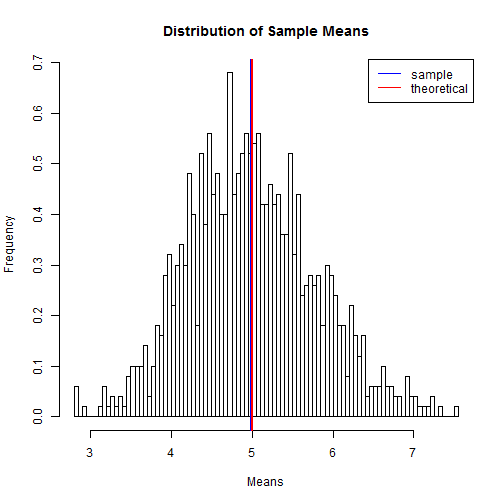
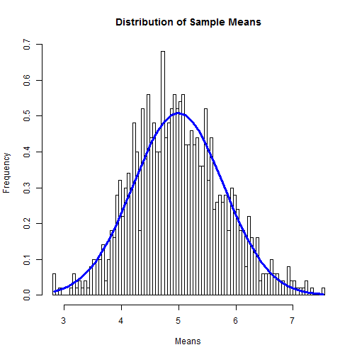

#Simulation Exercises

##Overview

This project investigates exponential distribution in R and compares it to the Central Limit Theorem. The exponential distribution is simulated with rexp(n, lambda) where lambda is the rate parameter and is set to 0.2 for all simulations. The mean and standard deviation of the exponential distribution is 1/lambda. The project involves running a series of 1000 simulations to create a data set for comparison. Each simulation contains 40 observations, meaning that the exponential distribution is simulated with rexp(40, 0.2). 

##Simulations

##Sample Mean versus Theoretical Mean

First, we compare the theoretical or expected mean (mu) to the sample mean. 

```{r}
sims = 1:1000; n = 40; lambda = 0.2 #set the known values
means <- data.frame(x = sapply(sims, function(x) {mean(rexp(n, lambda))})) #set data frame using known values
mu = 1/lambda # find the mu (expected mean)
print(sprintf("The expected mean of the exponential distribution is %f", mu))
mean <- mean(means$x) #find the sample mean
print(sprintf("The sample mean of the exponential distribution is %f", mean))
```

To visualize this, we can create a histogram and include lines to show both the mu and the sample mean. 

```{r}
hist(means$x, breaks=100, prob=TRUE, main="Distribution of Sample Means", ylab="Frequency", xlab="Means")
abline(v=mean(means$x), col="blue",lwd=2)
abline(v=1/lambda,col="red",lwd=2)
legend("topright", c("sample", "theoretical"), lty=c(1,1), col=c("blue", "red"))
```

 

##Sample Variance versus Theoretical Variance

Next we look at the theoretical variability by calculating the theoretical standard deviation and theoretical variance. 

```{r}
theory_sd <- (1/lambda)/sqrt(n) #find the expected standard deviation
print(sprintf("The expected standard deviation is %f", theory_sd))
theory_var <- theory_sd^2 #find the variance of the expected sd
print(sprintf("The theoretical variance is %f", theory_var))
```

We can compare those theoretical values to the sample by calculating variance using standard deviation. 

```{r}
sd <- sd(means$x)
print(sprintf("The sample standard deviation is %f", sd))
var <- var(means$x)
print(sprintf("The sample variance is %f", var))
```

##Distribution

We can see that the distribution of the sample means are approximately normal by creating a histogram and overlaying it with a curve. 

```{r}
x <- means$x
hist <- hist(x, breaks=100, prob=TRUE, main="Distribution of Sample Means", ylab="Frequency", xlab="Means")#plot a histogram as before
xfit <- seq(min(x), max(x), length=40)
yfit <- dnorm(xfit, mean=mean(x), sd=sd(x))
lines(xfit, yfit, col="blue", lwd=3) #overlay with a normal curve to show distribution
```

 